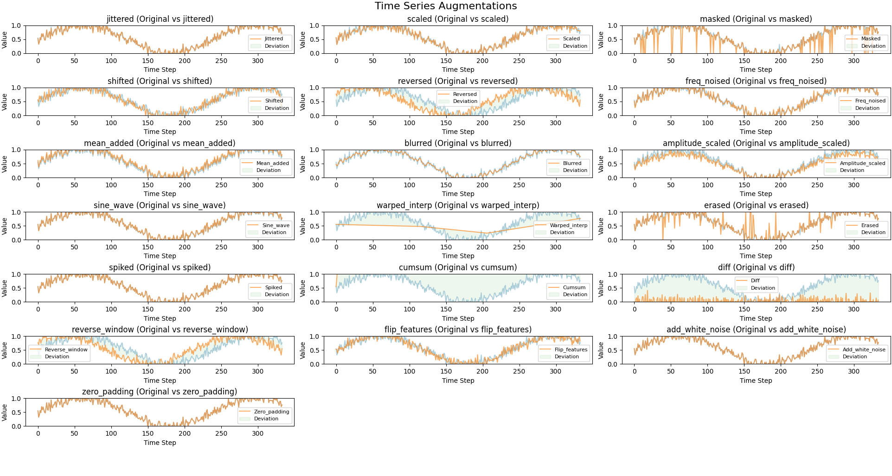
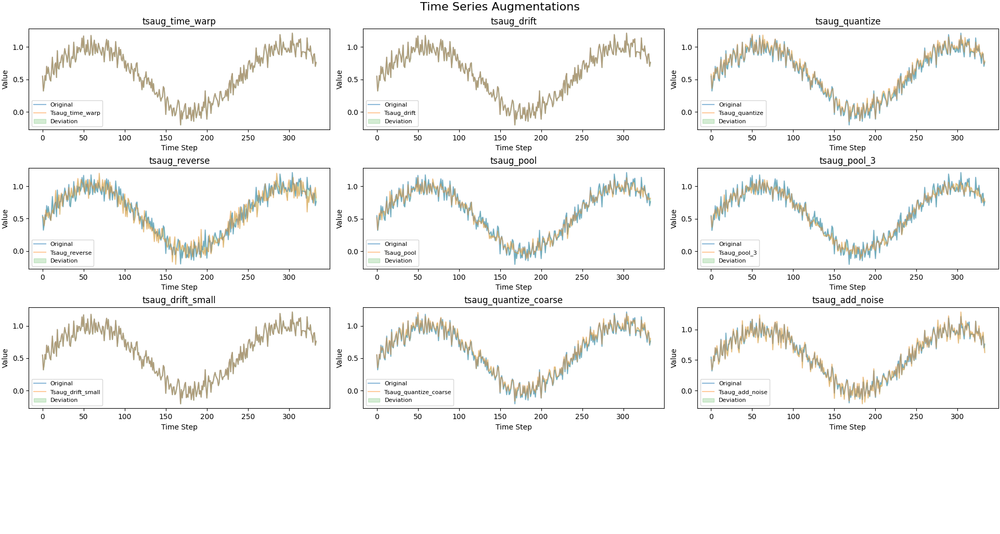

# ML Time Series Augmentation: What's Up? 

In time series ML models, data augmentation is a common tool. How can we do this augmentation today?

Let's explore three different augmentation strategies, there you have the visual results of each method :

---

## 1. Custom Augmentations (DIY Style)

**What it is:**  
A set of custom functions, essentially adding random "noise" to the time series. Techniques include:

- **Time warping/stretching:** Speeds up or slows down the sequence.
- **Jitter:** Adds random noise.
- **Window shearing:** Extracts and interpolates a portion of the series.
- **Masking/inverting/shifting:** Alters the temporal order or hides portions of the signal.
- **Frequency and trend noise injection:** Modifies the spectral or trend components of the signal.



**The code:**  
[Custom Augmentations - GitHub](https://github.com/Leci37/ML-Time-Series-Augmentation-What-s-Up-/blob/main/time_series.py)
'''

```python 
import numpy as np
from scipy.ndimage import gaussian_filter1d
from scipy.interpolate import interp1d

# Augmentation Methods
def jittering(data, sigma=0.02):
    """Adds Gaussian noise to the time-series data"""
    noise = np.random.normal(loc=0, scale=sigma, size=data.shape)
    return data + noise

def scaling(data, sigma=0.1):
    """Scales the time-series data by a random factor"""
    scale = np.random.normal(loc=1.0, scale=sigma, size=(data.shape[0], 1))
    return data * scale

def time_warping(data, alpha=1.5):
    """Randomly stretches or compresses the time series"""
    factor = np.random.uniform(low=1/alpha, high=alpha)
    indices = np.round(np.linspace(0, len(data) - 1, int(len(data) * factor))).astype(int)
    indices = np.clip(indices, 0, len(data) - 1)
    return data[indices]

def window_slicing(data, slice_ratio=0.9):
    """Randomly slices a portion of the time series"""
    slice_size = int(len(data) * slice_ratio)
    start = np.random.randint(0, len(data) - slice_size)
    return data[start:start + slice_size]

def time_masking(data, mask_ratio=0.1):
    """Randomly masks values in the time series"""
    mask = np.random.choice([0, 1], size=data.shape, p=[mask_ratio, 1 - mask_ratio])
    return data * mask

def rolling_shift(data, shift_max=10):
    """Randomly shifts the time-series data circularly"""
    shift = np.random.randint(-shift_max, shift_max)
    return np.roll(data, shift, axis=0)

def amplitude_scaling(data, factor_range=(0.8, 1.2)):
    """Scales the amplitude of the signal randomly"""
    factor = np.random.uniform(*factor_range)
    return data * factor

def sine_wave_perturbation(data, freq=0.1, magnitude=0.05):
    """Adds sinusoidal variation to the signal"""
    t = np.linspace(0, 2*np.pi, data.shape[0])
    sine_wave = np.sin(freq * t)[:, None] * magnitude
    return data + sine_wave

def time_warping_interpolation(data, num_knots=4, sigma=0.2):
    """Non-linear time warping using interpolation"""
    orig_time = np.arange(data.shape[0])
    knots = np.linspace(0, data.shape[0]-1, num_knots)
    warp_factors = np.random.normal(loc=1.0, scale=sigma, size=num_knots)
    warped_knots = np.clip(knots * warp_factors, 0, data.shape[0]-1)
    interpolator = interp1d(warped_knots, data[np.round(knots).astype(int)], axis=0, kind='linear', fill_value="extrapolate")
    return interpolator(orig_time)

def random_erasing(data, erase_ratio=0.1):
    """Randomly erases parts of the time series with noise"""
    erase_indices = np.random.choice([0, 1], size=data.shape, p=[erase_ratio, 1 - erase_ratio])
    noise = np.random.normal(loc=np.mean(data), scale=np.std(data), size=data.shape)
    return np.where(erase_indices == 0, noise, data)

def spike_injection(data, num_spikes=5, magnitude=0.2):
    """Injects random spikes into the time-series"""
    spike_indices = np.random.choice(data.shape[0], num_spikes, replace=False)
    data[spike_indices] += np.random.uniform(-magnitude, magnitude, size=(num_spikes, data.shape[1]))
    return data

def cumulative_sum(data):
    """Transforms data into cumulative sum form"""
    return np.cumsum(data, axis=0)

def differencing(data):
    """Applies first-order differencing"""
    return np.diff(data, axis=0, prepend=data[0:1])

def polynomial_trend_addition(data, degree=2, magnitude=0.05):
    """Adds a random polynomial trend to the time-series"""
    x = np.linspace(-1, 1, data.shape[0])  # Time index for polynomial evaluation
    coeffs = np.random.uniform(-magnitude, magnitude, size=(degree + 1, data.shape[1]))  # Generate coefficients
    trend = np.polynomial.polynomial.polyval(x[:, None], coeffs)  # Ensure trend has shape (478, 13)
    return data + trend

def reverse_augmentation(data):
    """Reverses the time-series data"""
    return data[::-1]

def time_stretching(data, stretch_factor=1.2):
    """Alters the speed of the time-series"""
    indices = np.round(np.linspace(0, len(data) - 1, int(len(data) * stretch_factor))).astype(int)
    indices = np.clip(indices, 0, len(data) - 1)
    return data[indices]

def permutation(data, segment_length=10):
    """Randomly permutes segments of the time series"""
    num_segments = len(data) // segment_length
    segment_indices = np.random.permutation(num_segments)
    permuted_data = np.concatenate([data[i * segment_length:(i + 1) * segment_length] for i in segment_indices], axis=0)
    return permuted_data

def frequency_noise(data, sigma=0.01):
    """Adds high-frequency noise to the signal"""
    noise = np.random.normal(loc=0, scale=sigma, size=data.shape)
    return data + np.sin(2 * np.pi * noise)

def mean_value_addition(data, alpha=0.1):
    """Adds a portion of the mean value of the series to itself"""
    mean_val = np.mean(data, axis=0)
    return data + alpha * mean_val

def gaussian_blur(data, sigma=1):
    """Applies Gaussian blur for signal smoothing"""
    return gaussian_filter1d(data, sigma=sigma, axis=0)
```

---

## 2. Tsaug Library

**Tsaug** is ideal for quick, scalable augmentation pipelines with clean, well-documented APIs. Key methods:

- **Time warp:** Non-linear temporal distortions
- **Crop:** Keep only part of the signal
- **Drift:** Gradual shift over time
- **Quantize:** Reduce signal precision
- **Reverse & pool:** Flip sequences or downsample



 **The code:**  
[Tsaug Example - GitHub](https://github.com/Leci37/ML-Time-Series-Augmentation-What-s-Up-/blob/main/time_series_tsaug.py)

---
```python
from tsaug import TimeWarp, Crop, Quantize, Drift, Reverse, Pool
# Define transformations explicitly
tsaug_time_warp = TimeWarp(n_speed_change=8, max_speed_ratio=5)
tsaug_drift = Drift(max_drift=(0.5, 0.5))
tsaug_quantize = Quantize(n_levels=4)
tsaug_crop = Crop(size=max(2, len(time_series_data) - 20))
tsaug_reverse = Reverse()
tsaug_pool = Pool(size=2)
tsaug_crop_small = Crop(size=max(2, int(len(time_series_data) * 0.5)))
tsaug_pool_3 = Pool(size=3)
tsaug_drift_small = Drift(max_drift=(0.03, 0.03))
tsaug_quantize_coarse = Quantize(n_levels=5)

# Define transformations with stronger effects
tsaug_time_warp = TimeWarp(n_speed_change=8, max_speed_ratio=5)
tsaug_drift = Drift(max_drift=(0.5, 0.5))  # previously 0.1
tsaug_quantize = Quantize(n_levels=4)  # previously 20 (too subtle)

# Then use these in the dictionary
augmentations = {
    "tsaug_time_warp": tsaug_time_warp.augment,
    "tsaug_drift": tsaug_drift.augment,
    "tsaug_quantize": tsaug_quantize.augment,
    "tsaug_crop": tsaug_crop.augment,
    "tsaug_reverse": tsaug_reverse.augment,
    "tsaug_pool": tsaug_pool.augment,
    "tsaug_crop_small": tsaug_crop_small.augment,
    "tsaug_pool_3": tsaug_pool_3.augment,
    "tsaug_drift_small": tsaug_drift_small.augment,
    "tsaug_quantize_coarse": tsaug_quantize_coarse.augment,
    "tsaug_add_noise": lambda x: x + np.random.normal(0, 0.05, x.shape)  # keep lambda where needed
}
```
**There you have the visual results of each method — use the one that comes closest to what you want!**


